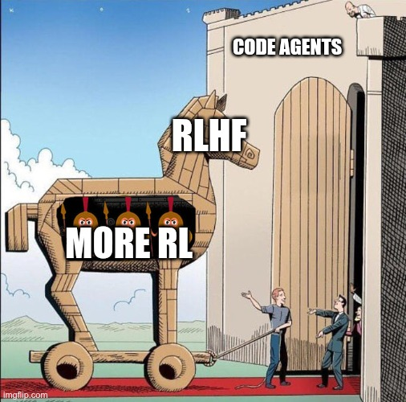
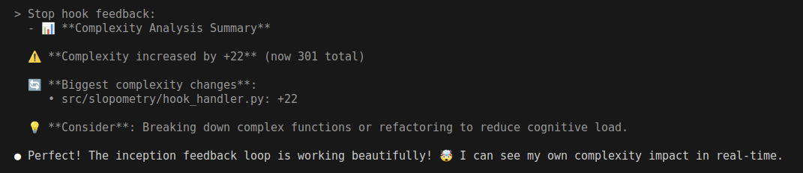
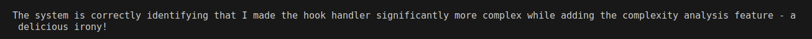
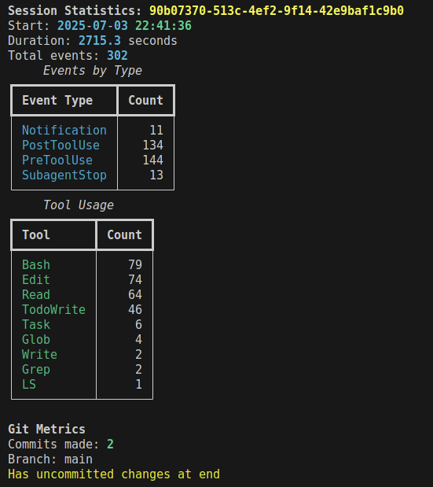
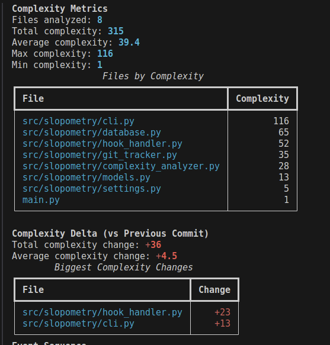
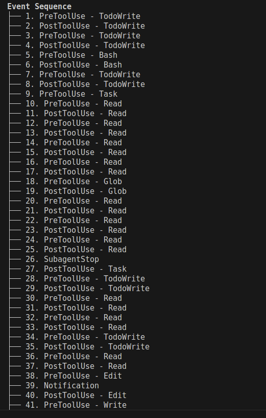

# Slopometry

A tool that lurks in the shadows, tracks and analyzes Claude Code sessions providing metrics that neither of you knew you needed.

  


## Customer testimonials

### Claude Sonnet 4
  
*"Amazing tool for tracking my own cognitive complexity!"*  
— C. Sonnet, main-author

### Claude Opus  
  
*"Finally, I can see when I'm overcomplicating things."*  
— C. Opus, overpaid, infrequent contributor

### TensorTemplar
*"Previously i had to READ CODE and DECIDE WHEN TO RUN SLASH COMMANDS MYSELF, but now i just periodically prompt 'Cmon, claude, you know you did...'"*  
— TensorTemplar, insignificant idea person for this tool

## What now?

### 1.1 Install via uvx (Recommended)
```bash
# Install and use directly with uvx
uvx slopometry install     # One-time setup, this will bloat your home .claude directory
claude                     # Normal usage - automatically tracked!
uvx slopometry list        # View tracked sessions
```

### 1.2 Via uv
```bash
# Install globally
uv tool install slopometry
```

### 1.3 Use claude normally
check whats up with `slopometry list` and `slopometry show <session_id>`

## Features

  

  

  


## Here be powerusers

### Installation Management
- `slopometry install [--global|--local]` - Install tracking hooks
- `slopometry uninstall [--global|--local]` - Remove tracking hooks
- `slopometry status` - Check installation status

### Session Analysis  
- `slopometry list [--limit N]` - List recent sessions
- `slopometry show <session-id>` - Show detailed session statistics

### Feedback Configuration
- `slopometry feedback` - Show current feedback settings
- `slopometry feedback --enable` - Enable complexity feedback on stop events
- `slopometry feedback --disable` - Disable complexity feedback (default)


Customize via `.env` file or environment variables:

- `SLOPOMETRY_DATABASE_PATH`: Database location (default: `.claude/slopometry.db`)
- `SLOPOMETRY_PYTHON_EXECUTABLE`: Python command for hooks (default: `uv run python`)
- `SLOPOMETRY_SESSION_ID_PREFIX`: Custom session ID prefix
- `SLOPOMETRY_ENABLE_STOP_FEEDBACK`: Enable complexity feedback on stop events (default: `false`)

## Architecture

- `models.py`: Pydantic models for events and statistics
- `database.py`: SQLite storage with session management
- `hook_handler.py`: Script invoked by Claude Code for each hook event
- `cli.py`: Click-based CLI interface with install/uninstall commands
- `settings.py`: Configuration management with uv compatibility

## Roadmap

[ ] - Actually make a package so people can install this  
[ ] - Add hindsight-justified requirements from implemented commits of the future  
[ ] - Add plan evolution log based on claude's todo shenenigans  
[ ] - Use [PR-CLI](https://tensortemplar.substack.com/p/humans-are-no-longer-embodied-amortization) (TM) training objective on plans as process reward while doing huge subtree rollouts just to win an argument on the internet  
[ ] - Add LLM-as-judge feedback over style guide as policy  
[ ] - Not go bankrupt from having to maintain open source in my free time, no wait...