# Slopometry

A tool that lurks in the shadows, tracks and analyzes Claude Code sessions providing metrics that none of you knew you needed.

  


**NEWS:** 

**December 2025: for microsoft employees we now support the Galen metric (Python only for now).**

Set `SLOPOMETRY_ENABLE_WORKING_AT_MICROSOFT=true slopometry latest` or edit your .env to get encouraging messages approved by HR!

Please stop contacting us with your cries for mercy - this is between you and your unsafe (memory) management.  

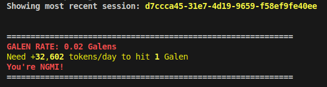

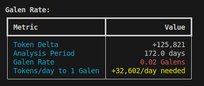  

# Features / FAQ

### Q: How do i know if claude is lazy today? 

A: Eyeball progress based on overall session-vibes, plan items, todos, how many tokens read/edited etc.

```bash
slopometry latest
```

  

Worst offenders and overall slop at a glance  

  

**See more examples and FAQ in details below**:
<details>

### Q: I don't need to verify when my tests are passing, right? 

A: lmao

Agents love to reward hack (I blame SWE-Bench, btw). Naive "unit-test passed" rewards teach the model to cheat by skipping them in clever ways.
What clevery ways you ask? Silent exception swallowing upstream ofc!

Slopometry forces agents to state the purpose of swallowed exceptions and skipped tests, this is a simple LLM-as-judge call for your RL pipeline (you're welcome)

Here is Opus 4.5, which is writing 90% of your production code by 2026:  
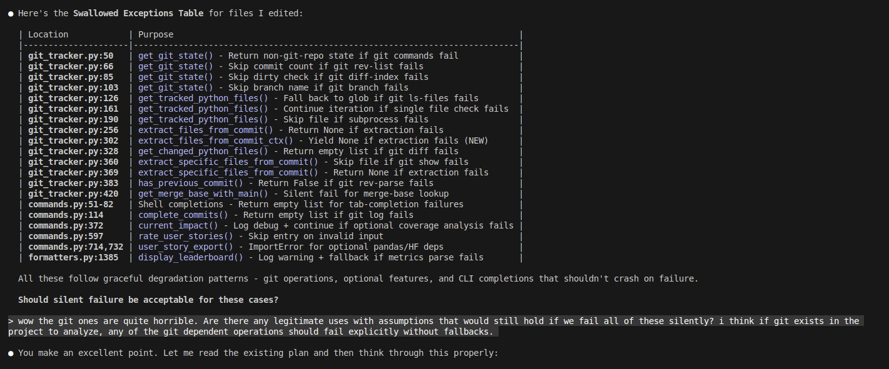
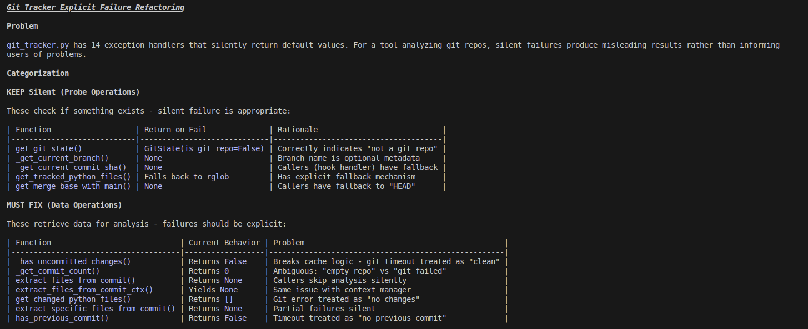
  
"> But tensor, i don't use slopometry and already committed to production!?"   
Don't worry, your customers probably don't read their code either, and their agents will just run python -c "<1600 LOC adhoc fix>" as a workaround for each api call.  

### Q: I am a junior and all my colleagues were replaced with AI before I learned good code taste, is this fine? 

A: Here are some dumb practices agents love to add, that would typically require justification or should be the exception, not the norm:

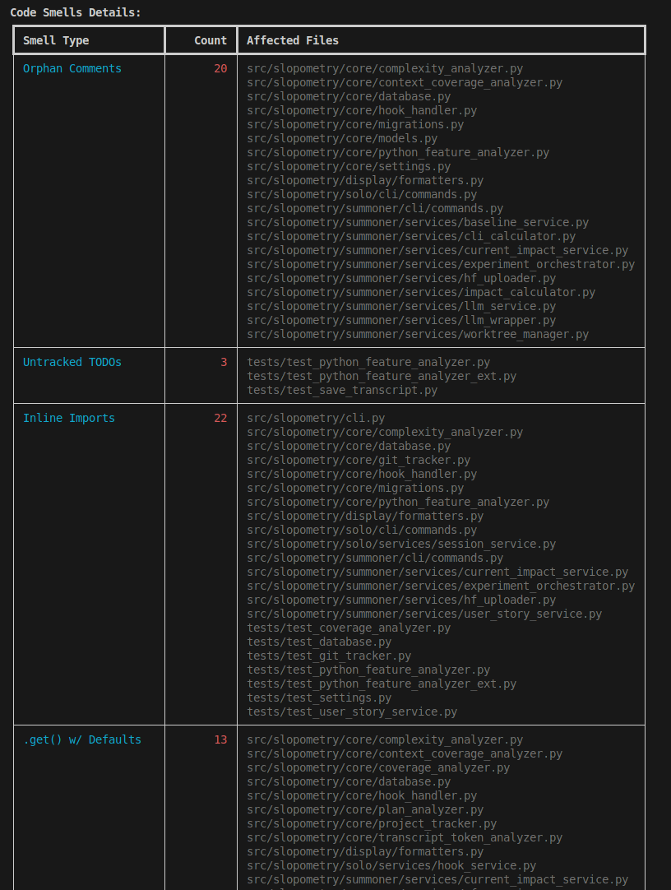

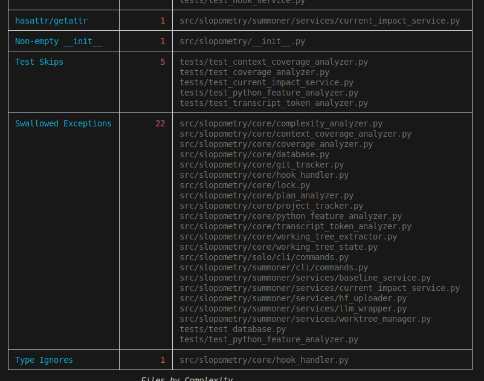

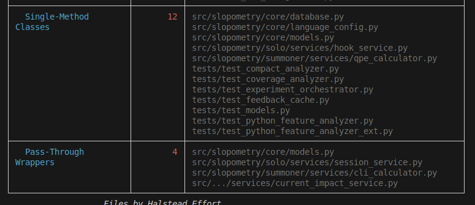  

### Q: I have been vibe-coding this codebase for a while now and learned prooompt engineering. Clearly the code is better now? 

A: You're absolutely right (But we verify via code trends for the last ~100 commits anyway):

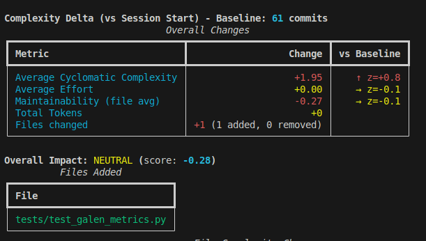

### Q: I use Cursor/BillionDollarVSCodeForkFlavourOfTheWeek, which uses embeddings and RAG on my code in the cloud, so my agent always knows which file are related to the current task, right? 

A: Haha, sure, maybe try a trillion dollar vscode fork, or a simple AST parser that checks imports for edited files and tests instead. Spend the quadrillions saved on funding researchers who read more than 0 SWE books during their careers next time.  

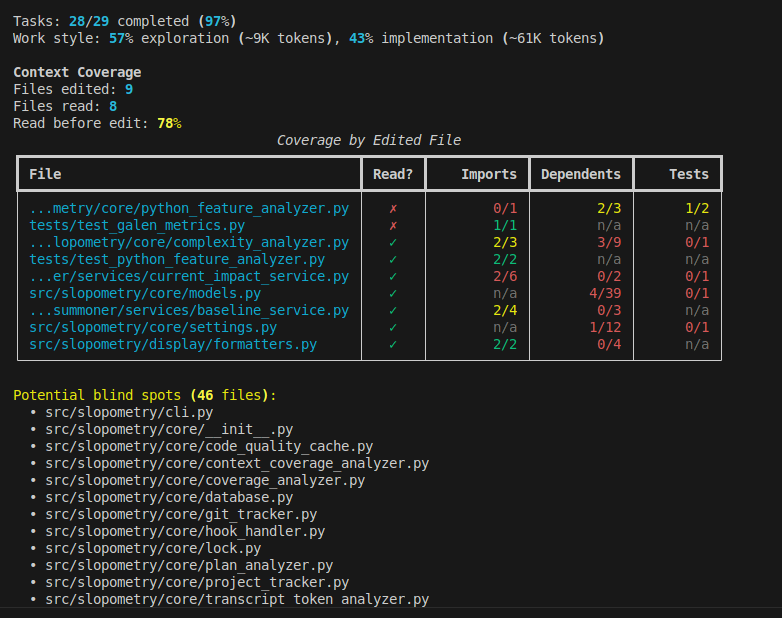

### Q: My boss is llm-pilled and asks me to report my progress every 5 minutes, but human rights forbid keylogging in my country, what do I do? 
A: export your claude code transcripts, including plan and todos, and commit them into the codebase!  

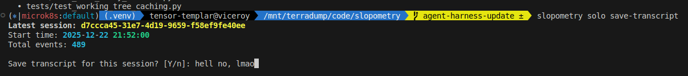
**legal disclaimer**: transcripts are totally not for any kind of distillation, but merely for personal entertainment purposes

### Q: Are these all the features, how is the RL meme even related?

A: There are advanced features for temporal and cross-project measurement of slop, but these require reading, thinking and being an adult.  

</details>


# Limitations

**Runtime**: Almost all metrics are trend-relative and the first run will do a long code analysis before caching, but if you consider using this tool, you are comfortable with waiting for agents anyway.

**Git**: This tool requires git to be installed and available in PATH. Most features (baseline comparison, commit analysis, cache invalidation) depend on git operations.

**Compat**: This software was tested mainly on Linux with Python codebases. There are plans to support Rust at some point but not any kind of cursed C++ or other unserious languages like that. I heard someone ran it on MacOS successfully once but we met the person on twitter, so YMMV.

Seriously, please do not open PRs with support for any kind of unserious languages. Just fork and pretend you made it. We are ok with that. Thank you.

# Installation

Both Anthropic models and MiniMax-M2 are fully supported as the `claude code` drivers.  
To setup MiniMax-M2 instead of Sonnet, check out [this guide](docs/text-ai-coding-tools.md)

### Install claude code (needs an account or api key)

```bash
curl -fsSL http://claude.ai/install.sh | bash
```

### Install slopometry as a uv tool

```bash
# Install as a global tool
uv tool install git+https://github.com/TensorTemplar/slopometry.git

# Add tool directory to PATH (required on macOS, may be needed on Linux)
uv tool update-shell

# Restart your terminal or run:
source ~/.zshrc  # for zsh
# or: source ~/.bashrc  # for bash

# Or install from a local directory
git clone https://github.com/TensorTemplar/slopometry
cd slopometry
uv tool install .

# After making code changes, reinstall to update the global tool
uv tool install . --reinstall
```

## Quick Start

Note: tested on Ubuntu linux 24.04.1

```bash
# Install hooks globally (recommended)
slopometry install --global

# Use Claude normally
claude

# View tracked sessions and code delta vs. the previous commit or branch parent
slopometry solo ls
slopometry solo show <session_id> 

# Alias for latest session, same as solo show <session_id>
slopometry latest

# Save session artifacts (transcript, plans, todos) to .slopometry/<session_id>/
slopometry solo save-transcript  # latest
slopometry solo save-transcript <session_id>
```

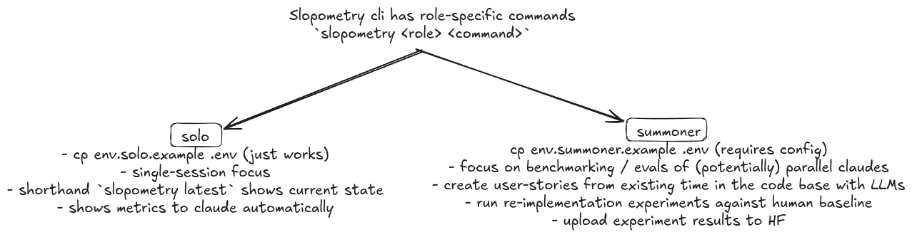  

## Shell Completion

Enable autocompletion for your shell:

```bash
# For bash
slopometry shell-completion bash

# For zsh  
slopometry shell-completion zsh

# For fish
slopometry shell-completion fish
```

The command will show you the exact instructions to add to your shell configuration.


## Upgrading

```bash
# Upgrade from git
uv tool install --reinstall git+https://github.com/TensorTemplar/slopometry.git

# Or if installed from local directory
cd slopometry
git pull
uv tool install . --reinstall

# Note: After upgrading, you may need to reinstall hooks if the default config changed
slopometry install
```

# Configuration

Slopometry can be configured using environment variables or a `.env` file:

1. **Global configuration**: `~/.config/slopometry/.env` (Linux respects `$XDG_CONFIG_HOME`)
2. **Project-specific**: `.env` in your project directory

```bash
# Create config directory and copy example config
mkdir -p ~/.config/slopometry

# Copy example config
curl -o ~/.config/slopometry/.env https://raw.githubusercontent.com/TensorTemplar/slopometry/main/.env.solo.example

# Or if you have the repo cloned:
# cp .env.solo.example ~/.config/slopometry/.env

# Edit ~/.config/slopometry/.env with your preferences
```


### Development Installation

```bash
git clone https://github.com/TensorTemplar/slopometry
cd slopometry
uv sync --extra dev
uv run pytest
```

Customize via `.env` file or environment variables:

- `SLOPOMETRY_DATABASE_PATH`: Custom database location (optional)
  - Default locations:
    - Linux: `~/.local/share/slopometry/slopometry.db` (or `$XDG_DATA_HOME/slopometry/slopometry.db` if set)
    - macOS: `~/Library/Application Support/slopometry/slopometry.db`
    - Windows: `%LOCALAPPDATA%\slopometry\slopometry.db`
- `SLOPOMETRY_PYTHON_EXECUTABLE`: Python command for hooks (default: uses uv tool's python)
- `SLOPOMETRY_SESSION_ID_PREFIX`: Custom session ID prefix
- `SLOPOMETRY_ENABLE_COMPLEXITY_ANALYSIS`: Collect complexity metrics (default: `true`)
- `SLOPOMETRY_ENABLE_COMPLEXITY_FEEDBACK`: Provide feedback to Claude (default: `false`)

# Cite

```
@misc{slopometry,
  title = {Slopometry: Opinionated code quality metrics for code agents and humans},
  year = {2025},
  author = {TensorTemplar},
  publisher = {GitHub},
  howpublished = {\url{https://github.com/TensorTemplar/slopometry}}
}
```

# Roadmap

[x] - Actually make a package so people can install this   
[ ] - Add hindsight-justified user stories with acceptance criteria based off of future commits  
[x] - Add plan evolution log based on claude's todo shenanigans   
[ ] - Rename the readme.md to wontreadme.md because it takes more than 15 seconds or whatever the attention span is nowadays to read it all. Maybe make it all one giant picture? Anyway, stop talking to yourself in the roadmap.  
[ ] - Finish git worktree-based [NFP-CLI](https://tensortemplar.substack.com/p/humans-are-no-longer-embodied-amortization) (TM) training objective implementation so complexity metrics can be used as additional process reward for training code agents  
[ ] - Extend stop hook feedback with LLM-as-Judge to support guiding agents based on smells and style guide  
[ ] - Not go bankrupt from having to maintain open source in my free time, no wait...
