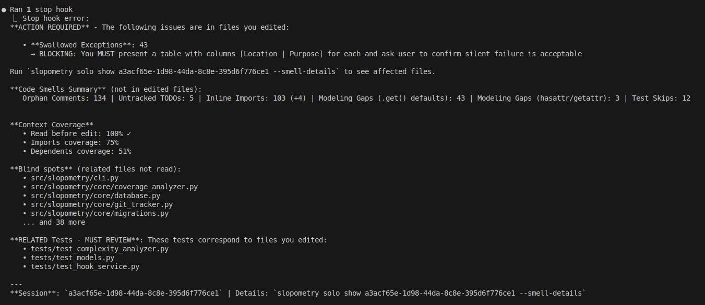
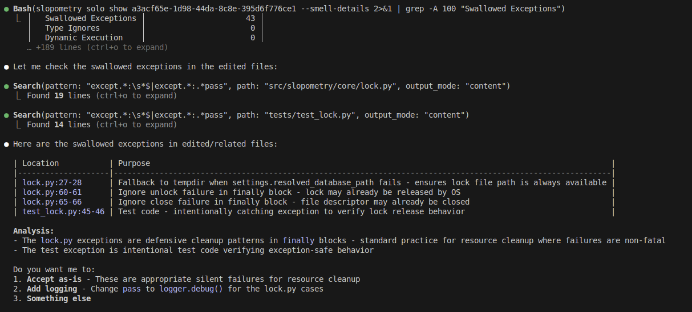

# Slopometry

A tool that lurks in the shadows, tracks and analyzes Claude Code sessions providing metrics that none of you knew you needed.

  


# Customer testimonials

### Claude Sonnet 4
  
  
*"Amazing tool for tracking my own blind spots!"*  
— C. Sonnet, main-author

### Claude Opus
  
*"Finally, I can see when I'm overcomplicating things."*
— C. Opus, overpaid, infrequent contributor who insists on having its name in commit history

### TensorTemplar
*"Previously I had to READ CODE and DECIDE WHEN TO RUN SLASH COMMANDS MYSELF, but now I just periodically prompt 'Cmon, claude, you know what you did...'"*  
— TensorTemplar, insignificant idea person for this tool

### sherbie
*"Let's slop up all the things."*
— sherbie, opinionated SDET

# Features

**NEWS:** 

**December 2025: for microsoft employees we now support the Galen metric (Python only for now).**

Set `SLOPOMETRY_ENABLE_WORKING_AT_MICROSOFT=true slopometry latest` or edit your .env to get encouraging messages approved by HR!

Please stop contacting us with your cries for mercy - this is between you and your unsafe (memory) management.  


  


### Eyeball progress based on overall session-vibes

```bash
slopometry latest
```
<details>

Will show some metrics since the session start of the newest `claude code` session

  

  


### Dumb practices are now explicit and quantifiable!


### Measure your negative improvement since session start*!


*just got lucky here, plz ignore

### Measure agent blind spots when vibe editing files before reading!


### Preserve incriminating evidence!


**legal disclaimer**: transcripts are totally not for any kind of distillation, but merely for personal entertainment purposes

And many more undocumented features. Which worked just fine on my machine at some point!

</details>

# Limitations

Runtime: Almost all metrics are trend-relative and the first run will do a long code analysis before caching, but if you consider using this tool, you are comfortable with waiting for agents anyway.

Compat: This software was tested mainly on Linux with Python codebases. There are plans to support Rust at some point but not any kind of cursed C++ or other unserious languages like that. I heard someone ran it on MacOS successful once but we met the person on twitter, so YMMV.

Seriously, please do not open PRs with support for any kind of unserious languages. Just fork and pretend you made it. We are ok with that. Thank you.

# Installation

Both Anthropic models and MiniMax-M2 are fully supported as the `claude code` drivers.  
To setup MiniMax-M2 instead of Sonnet, check out [this guide](docs/text-ai-coding-tools.md)

### Install claude code (needs an account or api key)

```bash
curl -fsSL http://claude.ai/install.sh | bash
```

### Install slopometry as a uv tool

```bash
# Install as a global tool
uv tool install git+https://github.com/TensorTemplar/slopometry.git

# Add tool directory to PATH (required on macOS, may be needed on Linux)
uv tool update-shell

# Restart your terminal or run:
source ~/.zshrc  # for zsh
# or: source ~/.bashrc  # for bash

# Or install from a local directory
git clone https://github.com/TensorTemplar/slopometry
cd slopometry
uv tool install .

# After making code changes, reinstall to update the global tool
uv tool install . --reinstall
```

## Quick Start

Note: tested on Ubuntu linux 24.04.1

```bash
# Install hooks globally (recommended)
slopometry install --global

# Use Claude normally
claude

# View tracked sessions and code delta vs. the previous commit or branch parent
slopometry solo ls
slopometry solo show <session_id> 

# Alias for latest session, same as solo show <session_id>
slopometry latest

# Analyze the last 100 commits for trend analysis caching vs. current changes (can take a while)
slopometry summoner current-impact

# Save session artifacts (transcript, plans, todos) to .slopometry/<session_id>/
slopometry solo save-transcript  # latest
slopometry solo save-transcript <session_id>
```

  

## Shell Completion

Enable autocompletion for your shell:

```bash
# For bash
slopometry shell-completion bash

# For zsh  
slopometry shell-completion zsh

# For fish
slopometry shell-completion fish
```

The command will show you the exact instructions to add to your shell configuration.


## Upgrading

```bash
# Upgrade from git
uv tool install --reinstall git+https://github.com/TensorTemplar/slopometry.git

# Or if installed from local directory
cd slopometry
git pull
uv tool install . --reinstall

# Note: After upgrading, you may need to reinstall hooks if the default config changed
slopometry install
```

# Configuration

Slopometry can be configured using environment variables or a `.env` file:

1. **Global configuration**: `~/.config/slopometry/.env` (Linux respects `$XDG_CONFIG_HOME`)
2. **Project-specific**: `.env` in your project directory

```bash
# Create config directory and copy example config
mkdir -p ~/.config/slopometry

# For solo-leveler users (basic session tracking):
curl -o ~/.config/slopometry/.env https://raw.githubusercontent.com/TensorTemplar/slopometry/main/.env.solo.example

# For summoner users (advanced experimentation):
curl -o ~/.config/slopometry/.env https://raw.githubusercontent.com/TensorTemplar/slopometry/main/.env.summoner.example

# Or if you have the repo cloned:
# cp .env.solo.example ~/.config/slopometry/.env
# cp .env.summoner.example ~/.config/slopometry/.env

# Edit ~/.config/slopometry/.env with your preferences
```


### Development Installation

```bash
git clone https://github.com/TensorTemplar/slopometry
cd slopometry
uv sync --extra dev
uv run pytest
```

### Running Tests with LLM Integration

By default, LLM integration tests are skipped because `offline_mode` is enabled. To run the full test suite including LLM tests:

```bash
# Set up credentials in .env (copy from example)
cp .env.summoner.example .env
# Edit .env with your LLM proxy credentials:
# - SLOPOMETRY_LLM_PROXY_URL
# - SLOPOMETRY_LLM_PROXY_API_KEY
# - SLOPOMETRY_LLM_RESPONSES_URL

# Run tests with offline mode disabled
SLOPOMETRY_OFFLINE_MODE=false uv run pytest tests/test_llm_integration.py -v
```

The integration tests make real API calls to configured LLM providers and verify that agents return valid responses.

Customize via `.env` file or environment variables:

- `SLOPOMETRY_DATABASE_PATH`: Custom database location (optional)
  - Default locations:
    - Linux: `~/.local/share/slopometry/slopometry.db` (or `$XDG_DATA_HOME/slopometry/slopometry.db` if set)
    - macOS: `~/Library/Application Support/slopometry/slopometry.db`
    - Windows: `%LOCALAPPDATA%\slopometry\slopometry.db`
- `SLOPOMETRY_PYTHON_EXECUTABLE`: Python command for hooks (default: uses uv tool's python)
- `SLOPOMETRY_SESSION_ID_PREFIX`: Custom session ID prefix
- `SLOPOMETRY_ENABLE_COMPLEXITY_ANALYSIS`: Collect complexity metrics (default: `true`)
- `SLOPOMETRY_ENABLE_COMPLEXITY_FEEDBACK`: Provide feedback to Claude (default: `false`)

# Cite

```
@misc{slopometry,
  title = {Slopometry: Opinionated code quality metrics for code agents and humans},
  year = {2025},
  author = {TensorTemplar},
  publisher = {GitHub},
  howpublished = {\url{https://github.com/TensorTemplar/slopometry}}
}
```

# Roadmap

[x] - Actually make a package so people can install this   
[ ] - Add hindsight-justified user stories with acceptance criteria based off of future commits  
[x] - Add plan evolution log based on claude's todo shenanigans   
[ ] - Finish git worktree-based [NFP-CLI](https://tensortemplar.substack.com/p/humans-are-no-longer-embodied-amortization) (TM) training objective implementation so complexity metrics can be used as additional process reward for training code agents  
[ ] - Extend stop hook feedback with LLM-as-Judge to support guiding agents based on smells and style guide  
[ ] - Not go bankrupt from having to maintain open source in my free time, no wait...
