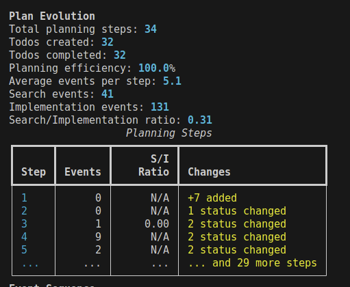

# Slopometry

A tool that lurks in the shadows, tracks and analyzes Claude Code sessions providing metrics that none of you knew you needed.

  


## Customer testimonials

### Claude Sonnet 4
  
*"Amazing tool for tracking my own cognitive complexity!"*  
— C. Sonnet, main-author

### Claude Opus  
  
*"Finally, I can see when I'm overcomplicating things."*  
— C. Opus, overpaid, infrequent contributor

### TensorTemplar
*"Previously i had to READ CODE and DECIDE WHEN TO RUN SLASH COMMANDS MYSELF, but now i just periodically prompt 'Cmon, claude, you know what you did...'"*  
— TensorTemplar, insignificant idea person for this tool

### sherbie
*"Let's slop up all the things."*
— sherbie, opinionated SDET

## Installation

### Install claude code

```bash
curl -fsSL http://claude.ai/install.sh | bash
```

### Install slopometry as a uv tool

```bash
# Install as a global tool
uv tool install git+https://github.com/TensorTemplar/slopometry.git

# Or install from a local directory
git clone https://github.com/TensorTemplar/slopometry
cd slopometry
uv tool install .
```

## Quick Start

```bash
# Install hooks globally (recommended)
slopometry install --global

# Use Claude normally
claude

# View tracked sessions
slopometry ls
slopometry show <session_id>
```

## Shell Completion

Enable autocompletion for your shell:

```bash
# For bash
slopometry completion bash

# For zsh  
slopometry completion zsh

# For fish
slopometry completion fish
```

The command will show you the exact instructions to add to your shell configuration.


## Upgrading

### Upgrade the uv tool

```bash
# Uninstall and reinstall to get the latest version
uv tool uninstall slopometry
uv tool install git+https://github.com/TensorTemplar/slopometry.git

# Or if installed from local directory
cd slopometry
git pull
uv tool uninstall slopometry
uv tool install .  --refresh

# Note: After upgrading, you may need to reinstall hooks if the default config changed
slopometry install
```

## Configuration

Slopometry can be configured using environment variables or a `.env` file:

1. **Global configuration**: `~/.config/slopometry/.env`
2. **Project-specific**: `.env` in your project directory

```bash
# Create config directory and copy example config
mkdir -p ~/.config/slopometry
# If installing from git:
curl -o ~/.config/slopometry/.env https://raw.githubusercontent.com/TensorTemplar/slopometry/main/.env.example
# Or if you have the repo cloned:
# cp .env.example ~/.config/slopometry/.env

# Edit ~/.config/slopometry/.env with your preferences
```

## Features

  

  

  

  

## Here be powerusers

### Development Installation

```bash
git clone https://github.com/TensorTemplar/slopometry
cd slopometry
uv sync --all-extras
```

### Installation Management
- `slopometry install [--global|--local]` - Install tracking hooks
- `slopometry uninstall [--global|--local]` - Remove tracking hooks
- `slopometry status` - Check installation status

### Session Analysis  
- `slopometry list [--limit N]` - List recent sessions
- `slopometry show <session-id>` - Show detailed session statistics

### Complexity Analysis Configuration
Configure complexity analysis via environment variables:
- `SLOPOMETRY_ENABLE_COMPLEXITY_ANALYSIS=true` - Collect complexity metrics (default: `true`)
- `SLOPOMETRY_ENABLE_COMPLEXITY_FEEDBACK=false` - Provide feedback to Claude (default: `false`)

Recommended: Keep analysis enabled for data collection, disable feedback for uninterrupted workflow.


Customize via `.env` file or environment variables:

- `SLOPOMETRY_DATABASE_PATH`: Custom database location (optional)
  - Default locations:
    - Linux: `~/.local/share/slopometry/slopometry.db`
    - macOS: `~/Library/Application Support/slopometry/slopometry.db`  
    - Windows: `%LOCALAPPDATA%\slopometry\slopometry.db`
- `SLOPOMETRY_PYTHON_EXECUTABLE`: Python command for hooks (default: uses uv tool's python)
- `SLOPOMETRY_SESSION_ID_PREFIX`: Custom session ID prefix
- `SLOPOMETRY_ENABLE_COMPLEXITY_ANALYSIS`: Collect complexity metrics (default: `true`)
- `SLOPOMETRY_ENABLE_COMPLEXITY_FEEDBACK`: Provide feedback to Claude (default: `false`)

## Architecture

- `models.py`: Pydantic models for events and statistics
- `database.py`: SQLite storage with session management
- `hook_handler.py`: Script invoked by Claude Code for each hook event
- `cli.py`: Click-based CLI interface with install/uninstall commands
- `settings.py`: Configuration management with uv compatibility

## Roadmap

[x] - Actually make a package so people can install this  
[ ] - Add hindsight-justified user stories with acceptance criteria based off of future commits
[x] - Add plan evolution log based on claude's todo shenenigans  
[ ] - Use [NFP-CLI](https://tensortemplar.substack.com/p/humans-are-no-longer-embodied-amortization) (TM) training objective over plans with complexity metrics informing a process reward, while doing huge subtree rollouts just to win an argument on the internet  
[ ] - Add LLM-as-judge feedback over style guide as policy  
[ ] - Not go bankrupt from having to maintain open source in my free time, no wait...
